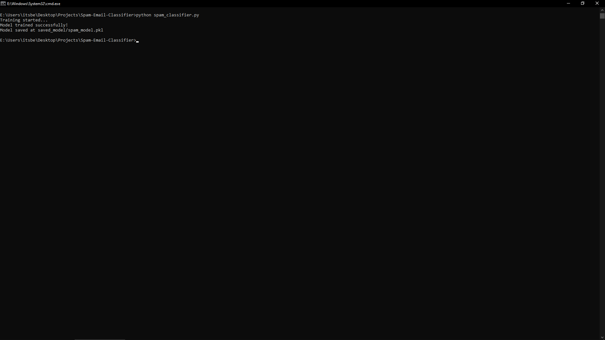
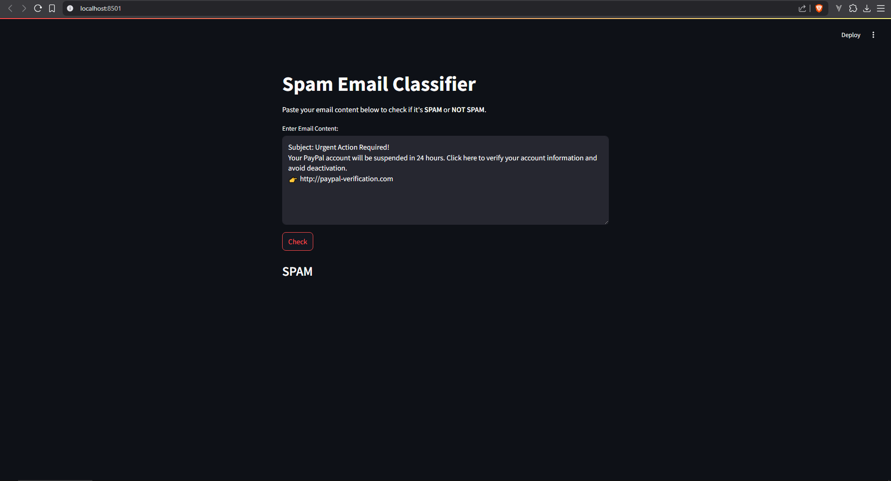
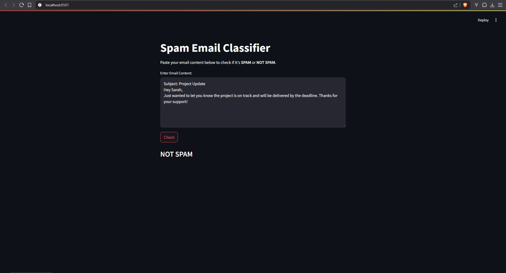

# 📧 Spam Email Classifier

This project is a **machine learning application** that detects whether an email is **SPAM** or **NOT SPAM** based on its content.  

It uses **TF-IDF vectorization** with **SVM (Support Vector Machine)** for classification and has an interactive web app built with **Streamlit**.

---

## 🚀 Features
✅ Detect SPAM/NOT SPAM from email text  
✅ Streamlit UI for easy testing  
✅ Trained on a labeled dataset  
✅ Ready-to-deploy model  

---

## 📂 Project Structure
spam-email-classifier/ 
├── dataset/            # Dataset (email_spam.csv) 
├── saved_model/        # Trained model (spam_model.pkl) 
├── spam_classifier.py  # Train and save model 
├── app.py              # Streamlit web app 
├── requirements.txt    # Python libraries 
└── README.md           # Project overview 

---

## 🛠 Requirements
- Python 3.x
- pandas
- scikit-learn
- streamlit

Install all libraries:
    pip install -r requirements.txt

---

## 🖥️ Screenshots

### 🏠 Model Training

### 🚨 Spam Detected

### ✅ Not Spam

---

## 🖥 How To Run
    1. Train the Model
        python spam_classifier.py

    2. Start the Streamlit App
        streamlit run app.py
